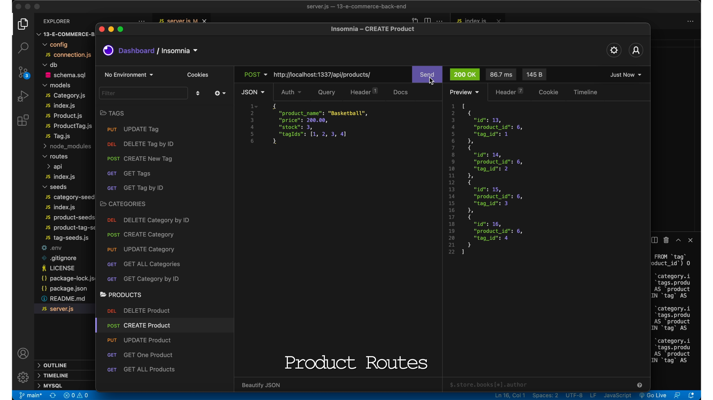

# E-Commerce Back End
  Video Demo: <a href="http://www.meetdru.com/files/ecommerce-backend">http://www.meetdru.com/files/ecommerce-backend</a> 

  
  ## Description
  This project challenged me to build backend routes for the initial concept of an e-commerce management system. The project required understanding and implementation of [MySQL2](https://www.npmjs.com/package/mysql), [Sequelize](https://www.npmjs.com/package/sequelize), and [Express.js](https://www.npmjs.com/package/express). The video demonstrates a server recieving create, read, update, and delete requests and responding respectfully.

  ## License
  Use of this project is subject to the terms and conditions of the <a href="https://www.mit.edu/~amini/LICENSE.md">MIT License</a>.
  ## Questions
  - Please email any questions to: <a href="mailto:dru.ludwig-github@yahoo.com">dru.ludwig-github@yahoo.com</a>
  - Find me on GitHub: <a href="https://github.com/druludwig">druludwig</a>
  ## Screenshot

  
 
